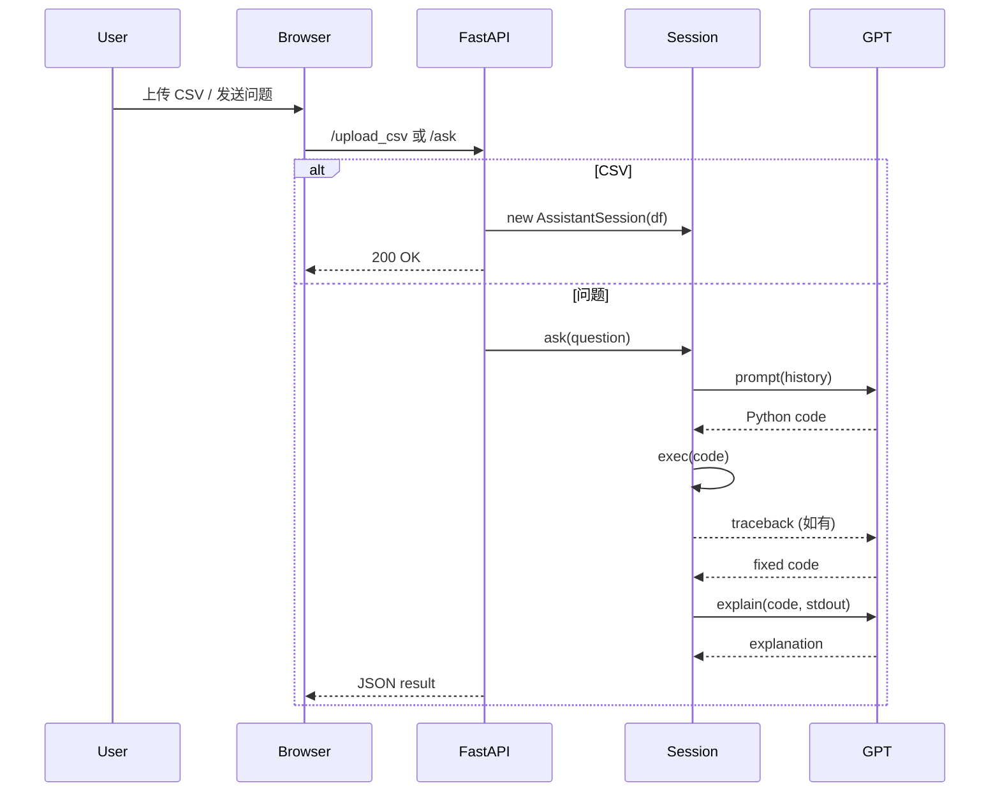

# CSV Assistant 代码实现说明

额外功能： 通过中转站可调用不同模型；保留base语言模型的对话功能；前后端交互（通过中转站调api比较慢）

---

## 1. 项目结构概览

```text
csv_assistant/
├── api_server.py          # FastAPI 后端
├── assistant.py           # 纯终端交互脚本
├── cli.py                 # 一键启动 Web 模式脚本
├── data.csv               # 示例数据
├── frontend/              # React + Vite 前端
│   ├── src/
│   │   └── App.tsx        # 前端核心逻辑
│   └── ...
├── requirements.txt       # Python 依赖
└── ...
```

---

## 2. CLI 模式 (`assistant.py`)

- 使用 `prompt_toolkit` 读取命令行输入，支持多行 & 语法高亮
- 用户通过命令行参数传入 CSV 路径，程序结束时输入 `exit` / `quit`

| 方法 | 功能 |
|------|------|
| `call_llm` | 调用 OpenAI ChatCompletion，加入温度等参数 |
| `extract_code` | 用正则从回复中提取 ```python 代码块 |
| `execute_python` | 隔离执行代码并捕获输出/异常 |
|`system_prompt`|  构造系统消息 |
| `ask` | <br>1\) 构造系统 & 历史消息 → 调用大模型<br>2\) 自动纠错（可设置次数）<br>3\) 捕获生成的图片并转成 base64<br>4\) 再次调用模型解释代码 + 输出 |

---

## 3. 后端核心 (`api_server.py`)

### 3.1 `AssistantSession` 类
> 实现同CLI模式

> 会话级状态（DataFrame+历史）保存在内存中，若需多用户隔离可改为依赖注入或 Redis。

### 3.2 REST API 列表

| 路径 | 方法 | 说明 |
|------|------|------|
| `/api/ask` | POST | 提问，返回 `code/stdout/explanation/images` |
| `/api/upload_csv` | POST | 上传并加载 CSV 文件 |
| `/api/load_csv` | POST | 从服务器指定路径加载 CSV |
| `/api/reset` | POST | 重置会话 |
| `/api/set_model` | POST | 动态切换大模型 |

FastAPI 还会在生产模式下挂载 `frontend/dist` 以支持 SPA 刷新。

---

## 4. 前端（`frontend/`）

- **技术栈**：React 18 + TypeScript + Vite
- **状态管理**：使用 `useState` 维护 `history / selectedModel / isLoading` 等
- **主要交互**：
  - 上传文件 → `POST /api/upload_csv`
  - 提问 → `POST /api/ask`
  - 重置 → `POST /api/reset`
- **UI**：
  - 使用 `react-syntax-highlighter` 渲染 Python 代码
  - 图表以内嵌 base64 显示，无需额外静态资源
  - 侧边栏可折叠，支持模型选择

---

## 5. 数据流示意

